# CPEN 211 Exam Review

### December 14 2024

# Slide Set 10: Adders

## Half and Full Adders
Addition is performed, like everything else, via circuits and the basic gates we've been introduced to.

**Half Adders**
- Two binary inputs, one binary output of 0, 1, or 2
  
**Full Adders**
- Three binary inputs, one binary output of 0, 1, 2, or 3

One thing we need, however, is a carry over. For 1+1 for example, we need two bits to represent it, so we must "carry over" a bit just like we would with regular addition. This is represented in the following diagram:

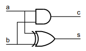

And in the following verilog code for a half adder:

``` Verilog
// half adder
module HalfAdder(a,b,c,s); 
    input a,b ;
    output c,s ; // carry and sum
    wire s = a ^ b ; 
    wire c = a & b ; 
endmodule
```

A full adder can be mplemented as:

``` Verilog
// full adder - logical 
module FullAdder2(a,b,cin,cout,s) ; 
    input a,b,cin ; output cout,s ; // carry and sum
    wire s = a ^ b ^ cin ; 
    wire cout = (a & b)|(a & cin)|(b & cin) ; // majority endmodule
```

Or alternatively, made out of half adders:

``` Verilog
module FullAdder1(a,b,cin,cout,s) ; 
    input a,b,cin ; 
    output cout,s ; // carry and sum
    wire g,p ; // generate and propagate 
    wire cp ; HalfAdder ha1(a,b,g,p) ; 
    HalfAdder ha2(cin,p,cp,s) ;
    assign cout = g | cp; 
endmodule
```
We can make multi-bit adders by chaining together full adders:

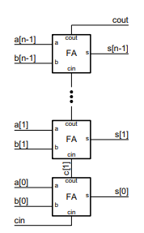

Here, we begin at the bottom. We add the LSB of `a` and `b`, take their value, and send the carry over to the next full adder. In this way, we can compute addition for an arbitrary number of bits!

> Note, I think it's quite interesting how this adding procedure is practically identical to how we were taught to add as kids!

What we just described above is a ***Ripple Carry Adder***, which in verilog looks something like:

``` Verilog
module Adder2(a,b,cin,cout,s) ; 
    parameter n = 8 ; 
    input [n-1:0] a, b ;
    input cin ; output [n-1:0] s ; 
    output cout ;

    wire [n-1:0] p = a ^ b ;
    wire [n-1:0] g = a & b ; 
    wire [n:0] c = {g | (p & c[n-1:0]), cin} ; 
    wire [n-1:0] s = p ^ c[n-1:0] ; 
    wire cout = c[n] ; 
 endmodule
```

## Negative Numbers

How do we represent negative numbers in binary? It's not like we can just append a little dash to the beginning (or maybe you can idk put unicode in ur binary, not my problem)

There are three ways to do this:

**Sign Magnitude**
- Append a `0` to the MSB for positive and a `1` for negative.
  
**One's Complement**
- Flip all bits in the number.

**Two's Complement**
- Flip all bits in the number and then add `1`.

To convert back from negative to positive, just do the operation again! Imagine it like mulitplying by `-1`.

## Two's Complement

For this part of the course, at least, we'll be using *Two's Complement.* Why? It make **subtraction** really easy. Essentially, we represent any number $x$ as $2^x-x$. Then, instead of subtracting, we can just add to do arithmetic! Take the example below of 1 - 2:

$$
\begin{align*}
    1 = 0001 \\
    -2 = 1110 \\
    0001 + 1110 = 1111 \\
    1111 = -1
\end{align*}
$$

So now, we don't need to implement a subtraction circuit in a CPU! That's pretty cool!

However, we have one slight issue...

### Overflow my bitch

If we use two bits, and we want to add 1+1, we run into an issue. THe binary representation of this is `10`, which, if we allowed signed numbers, means that `2` gets interpreted as `-2`! So how do we solve this?

Well, unfortunately, there's not a great way. But, we can at least identify if its happened or not! Here's the formula for it:

<center>If inputs share the <i>same</i> sign...</center>
<center>But the result is a <i>different</i> sign...</center>
<center>Then you've got overflow!</center><br>

It's not too difficult to detect this onboard the circuit. Simply check the most significant bits of the inputs against the most significant bits of the output!

# Slide Set 11: CaseX, Read Write Memory, and Datapath State Machines

## Casex

Let's introduce a brand new verilog function! The `casex` function! So what does it do? Well, `casex`, like a `case`, takes in an input but allows `x` in the corresponding cases. What does that look like?

``` Verilog
casex(in)
    4'b0xx1: value = true;
    default: value = false;
endcase
```
Here, `in` can take on the values:
- `4'b0001`
- `4'b0011`
- `4'b0101`
- `4'b0111`

And these would all be considered one case! As per usual, `x` just means don't care, so we simply ignore those bits and check `in[3]` and `in[1]` in this case. This can be very useful for implementing KMAPS (god i hate those things) in Verilog! For example, if we had a cover like `0xx1`, then instead of making individual cases, we can now take the entire cover as a single term in our case statement.

> Note: If the select input (`in`) contains unknown signals like `x`, Verilog will match it with `0`,`1`, and `x` in case labels. So `in = 4'b011x` would match with `4'b0xxx`. This behaviour could be dangerous!

## Datapath State Machines

Recall that a finite state machine is just a register that stores the current state, a function that computes the next state, and a function that computes the output, as illustrated:

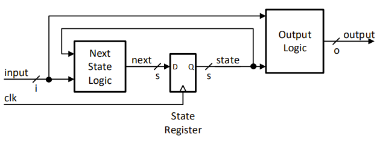

A Finite state machine relies on, well, *finite* logic. We need to specify every possible state and how to get to each of them. But this is kinda bad when we need a state machine to compute an arbitrary number of states. Take a counter, for example, counting to 100, 1000, 10000? They all take vastly different numbers of states. Instead of making *finite* states, we use a *datapath* to control the states. So in the case of our counter, we have:

``` Verilog
    if (clk) counter = counter + 1;
```

A great upgrade from:

``` Verilog
    case(count)
        1: count = 2;
        2: count = 3;
        3: count = 4;
        ...
    endcase
```
Now, this example is obviously oversimplified, but it gets the message across. Also be on the lookout for *Symbolic State Tables*, like this example for the counter again:

state | next_state
|-|-|
1|2
2|3
3|4
...

Which we now replace with:
state | next_state
|-|-|
count|count+1

Isn't that so much easier on the eyes?

## Read Write Memory

So, it suddenly hit CPU manufacturers one day that, maybe it'd be a good idea to *save* some of that information we just computed, so now we have **RAM!** (my beloved ddr5). Let's start with some definitions:

- **Address**: A location in memory
- **Address Space**: Total number of addresses
- **Addressability**: The number of bits in each address

Let's recall my boy the **Level-Sensitive D-Latch**, this basic address system is how we'll store data. By chaining hundreds of d-latches together and incorporating selectors, decoders, and multiplexers, we can create something like:

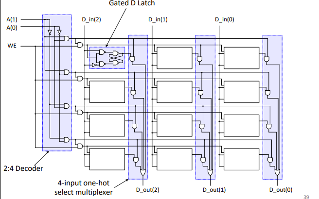

A Memory module! Which allows us to select memory locations (rows) and write or read from them.

# Slide Set 12: Arbitrary Digial Systems:

Sometimes, we don't want to create specific systems that can only solve one task. We want systems that can do everything! So how do we do that? Well, we can create on by combining a Control Finite State Machine and a Datapath.

## We can start with a quick example:

**Multiplier:**

Let's imagine a circuit that multiplies two numbers and outputs their result, pretty simple right?

Now, let's buff this up and try to create a design that can calculate an arbitrary exponent of two numbers $x^a$. Logically, we could use the multiplier to multiply x by itself, but we would need a lot of multipliers chained together, and if $a$ is arbitrary then we're kinda stuck.

But now, we know what datapaths are! So let's just define one that does the job for us! Something like:

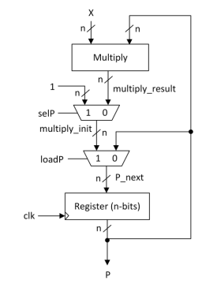

Now, this example isn't exactly complete, but it gives us a good enough starting point.

So, what's the procedure for this process to design a FSM Controller?

- Manually, work out a timeline of what needs to
happen on each rising edge of clock for sample
inputs.
- Use timeline to add states and determine
outputs. Things to keep in mind while doing this:
  - Each clock cycle corresponds to being in a given state
in the FSM controller (might stay in a given state more
than one cycle).
  - The datapath update specified by the FSM control
inputs occurs on the next rising edge (e.g., as you
leave the state).

## Tri-State Driver stuff

Recall my boy the Tri-State Driver:

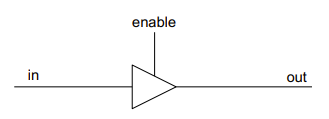

When `enable` is on, `out` becomes `in`. What happens to out when `enable` is off? One might think the value of `out` would be `0`, but that's not true! In actuality, its `z` (high impedance). So when writing a tri-state driver in verilog, make sure to do:
``` Verilog
assign out = enable ? in : {n{1’bz}};
```
And not:
``` Verilog
if (enable == 1'b1)
    out = in;
```
Tri State Drivers are typically used when there are multiple possible outputs on a single wire and we want to be able to select which one to use:

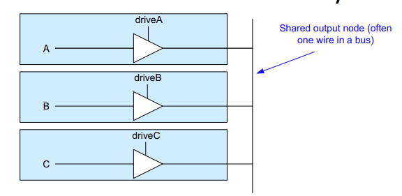

Here, for example, we don't want A to mix with B or C. So if we shut down B and C, we can be sure only A passes into the output. It's kinda like a multiplixer in that sense!

# Slide Set 13: Timing

Hm... What does the clock speed of a CPU actually mean? I mean, I know higher is better, but nobody ever really said *why* higher is better. Let's figure it out!

Per usual, let's start with some definitons. For any circuit, take:

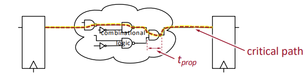

We can define the following:
- **Digital Circuit**: is really just *combinational logic* in between *flip-flop registers*
- **Propagation delay**: is the time for a gate's (like an AND gate) outputto stabilize after its inputs are changed
- **Critical Path**: is the slowest path between registers. This determines the *maximum clock frequency*

Wait, why do gates delay? Isn't electricity like light speed? Well, all gates in practice are modelled as **RC Circuits**, meaning their is some resistance source and some capacitor. Guess what? This bitch ass capacitor like always behaves like a fucking logarithm so there's a charge up time! Yippee!

Unsurprisingly, gates in series accumulate delays, and delays get longer if a gate outputs to more and more gates (fanout), since all the capacitance from the extra gates add up.

**Okay, so now when we deal with Timing analysis, we need to take Gate Delay into account!**

Since we rely so heavily on flip-flops, its a good idea to take a look at those:

## Flip Flop Delays!

First off, D flip-flops work in two **feedback loops**:

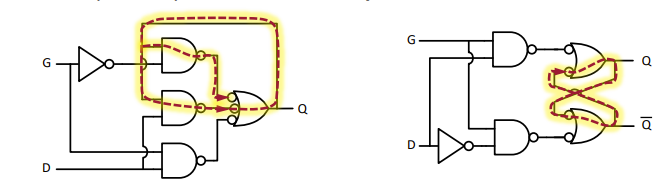
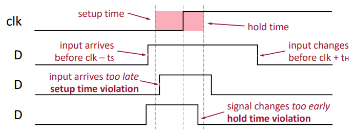


From this, we have three timing constraints:

- $t_S$: **Setup Time** - D input steady before posedge `clk`
  - The time it takes to stabalize the first latch feedback loop before the clock changes
  - How early 
- $t_H$: **Hold Time** - D input steady after posedge `clk`
  - The time it takes for the clock to propagate to isolate the first latch feedback loop
- $t_{CQ}$: **clock-to-Q Time** - When output appears on `Q` after posedge `clk`
  - Time for the clock to propagate to the second latch output

Here's the important stuff to remember:
- **propagation delay (gates)**
  - how soon the output changes after an input change
- **setup time (flip-flops)**
  - how early before posedge clk the input has to become stable
- h**old time (flip-flops)**
  - how long after posedge clk the input must remain stable
- **clk-to-Q time (flip-flops)**
  - how soon after posedge clk the DFF’s contents appear on Q


**Now, let's learn how to use all this together:**

## Timing Analysis

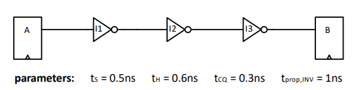

Take this circuit. We can find:

**The minimum clock period?**
> Add all the numbers! On the left we have the $t_{CQ}$ of `A`, three counts of $t_{\text{prop}}$, and on the right we have the $t_S$ of `B`, which comes out to: 0.3+1+1+1+0.5 = 3.8 ns

**The Max Frequency?**
> 1/ 3.8 ns = 263.2 MHz

**The slack at 100 MHz?**
> 100 MHz = 10 ns: 10 - 3.8 = 6.2 ns

**Met timing at 100 MHz?**
> Slack is positive so we have room! Therefore yes!

Looking at the example above, what happens if a signal from `A` arrives to `B` too early? If we assume there are no NOT gates, then based on $t_{CQ}$ we have the signal arrive at `B` in 0.3ns after the clock. However, `B`'s hold time is 0.6 ns. Our input to `B` arrived too early! So that violates our timing. What can we do?

***The dumbest fucking thing imaginable, of course***
> Aritificially increase the time it takes to get to `B` by adding some gates in the way! Two NOT gates for example would work great here!

So, in summary, we need to know:

- what propagation delay, setup time, hold time, and clk-to-Q time are
- how they arise from the transistor RC model
- finding the critical path given circuit (longe    st delay between flip-flops)
- timing analysis from constraints (max frequency, min period, slack, etc.)
- ways of fixing violations of setup time and hold time

Now, let's move on to something even shittier:

# Slide Set 14: Instruction Pipelining

## But what is performance?

Performance is a unit of things per second. For example, if we consider response time to be the unit of performance we have:

$$
\text{performance} = \frac{1}{\text{Execution Time}}
$$

Calculating this gets harder as we define a more rigorous definition of what performance is, exactly. Normally, we use the definition of ***average cycles per instruction (CPI)***. We define this as:

$$
\text{CPI} = \frac{\text{cycles (CPU Time * Clock Rate)}}{\text{Instruction Count (IC)}}
$$

We can also define cycle time as:

$$
\frac{1}{\text{clock frequency}}
$$

So these definitions are substitutable. To check how much faster a CPU is over another, just put one answer over the other like a good ol' ratio.

**With all that out of the way, let's actually talk about pipelining now!**

## Pipelining

Let's recall how the basic RISC architecture works:

1. Instruction fetch cycle (IF)
   - Send PC to memory and fetch the current instruction from memory. Update the PC to next sequential PC by adding 4
2. Instruction Decode/Register fetch cycle (ID)
   - decode instruction (what does it do?)
   - read source registers
3. Execute/effective address cycle (EX)
   - Compute branch target and condition
   - memory reference: ALU computes effective address from base
register and offset.
   - register-register ALU instruction: ALU performs operation
   - register-immediate ALU instruction: ALU performs operation
4. Memory access (MEM)
   - load: read memory @ effective address
   - store: write value from register to effective address
5. Write-back cycle (WB)
   - Register-Register/Register Immediate/Load: Write the result into the register file.

Alright, so how do we start pipelining something? The idea is to effectively start running instructions simeultaneously to save time, but this requires us to know what we can run and can't run in this way.

We begin with some lofty goals:

**Uniform Subcomputations**
- We want each stage to have the same delay, and we'll achieve this by balancing pipeline stages

**Identical Computations**
- Each computation should use same number of stages

**Independent Computations**
- Start a new computation each cycle.


**Let's get this show on the road!**

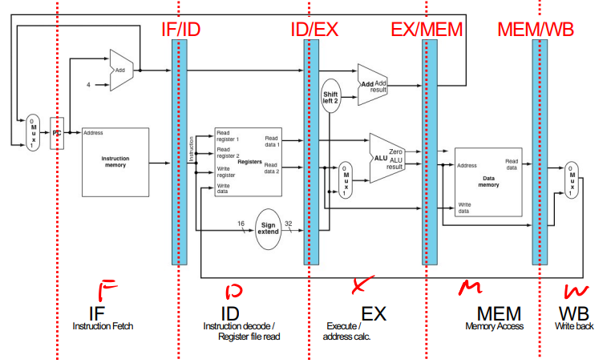

We begin by adding pipeline registers in between all the stages (the blue stuff). For example, we have one in between Instruction Fetch and Instruction Decode. These registers keep their value after a rising edge of the clock.

Pipelining itself is really just the act of not wasting time. If part of the processor can be used during a clock cycle to execute an instruction, we use it!

So let's take a look at:

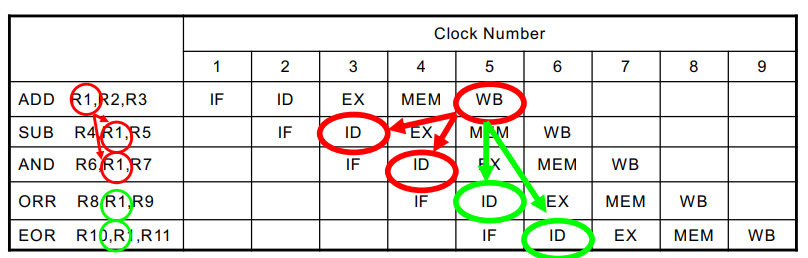

Which is a basic view of pipelining. There is an issue, however. The second instruction `SUB` requires `R1` in cycle 3, but the value of `ADD` is only written to `R1` in cycle 5! How can we solve this?

This is what's know as a **Pipeline Hazard**, of which we have three types that we will analyze:

### Structural Hazards
Caused by resource conflicts, where two instructions want to use the same hardware at the same time. We fix this by either:
1. Make one stall, reducing performance
2. Use better hardware that can handle multiple instructions

An example of a structural hazard would be one instruction writing to Memory while another is trying to read from it

### Data Hazard
The one we saw earlier, where data needed by an instruction does not exist yet. Also known as **RAW Hazards** (Read After Write Hazard)

We can fix this through **Forwarding** data. In our example above, imagine the `ADD` instruction on cycle 3 immediately sending the data of `R1` to the `SUB` instruction, instead of waiting for the `write back` stage.

Of course, now its a a question of how we control a forwarding path!

## Pipeline Control Signals

The methods we've used for control before won't work here, so we need something new. We'll start with combinational control and expand upon it:

We'll begin by seperating signals into groups, one per stage, and add pipeline registers for each:

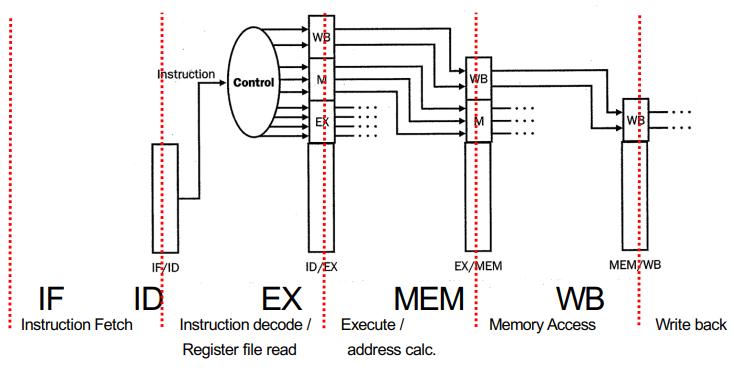

We then use all that to convert a CPU from this:

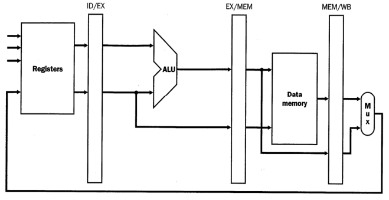

To this...

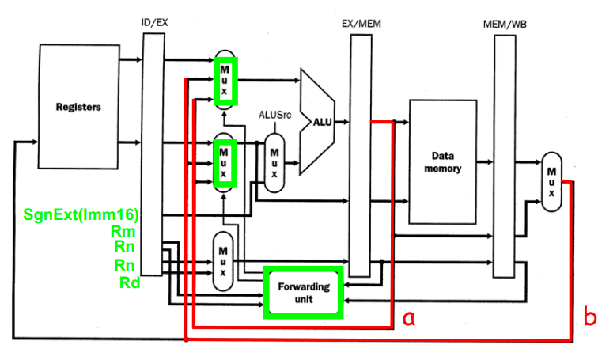

Where a Forwarding Unit controls Multiplixers that determine where the signal for a given part of the execution cycle comes from. For example, the ALU can now take inputs from Registers, the Execute stage, or the writeback stage.

Of course, this doesn't eliminate every hazard. Sometimes there will just be instructions we have no choice but to stall for. In these cases, we add "no op" instructions which effectively stall the CPU.
> Unavoidable stalls occur when the stage producing the forwarded value is “later” in pipeline than stage consuming the value and there are “not enough” instructions separating these two instructions.

Of course, this means we need a way to detect Hazards and ensure we can catch the ones we can forward and the ones we can't. We have two options for where we can add this: Decode or Execute stages.

### Control Hazards

Took a while to get here! Now, a branch may or may not change the program counter. Therefore, the instruction that follows a branch depends on the result of executing the branch instruction. So how do we pipeline this? Well, a result of a branch is typically known be the end of Instruction Decode or Execute. But we'll get back to that.

### Option 1: Stall

We first define some terms:

**Branch Instruction**
- The instruction that determines the branch

**Branch Successor**
- One of the branches

In stalling, we simply force a branch successor's fetch cycle to wait for the execute stage of the branch instruction, upon which we can then forward the instruction to the branch successor.

### Option 2: Branch Prediction

Many branches are "weakly" biased, meaning we take them or not take them roughly the same number of times. So, about half the time, we could've just guessed the branch. But this also means half the time we'd be wrong, so we would need a way to correct our mistake.

If we're correct in our prediction, no work needs to be done! The program just chugs along forward.

If we're wrong, then:

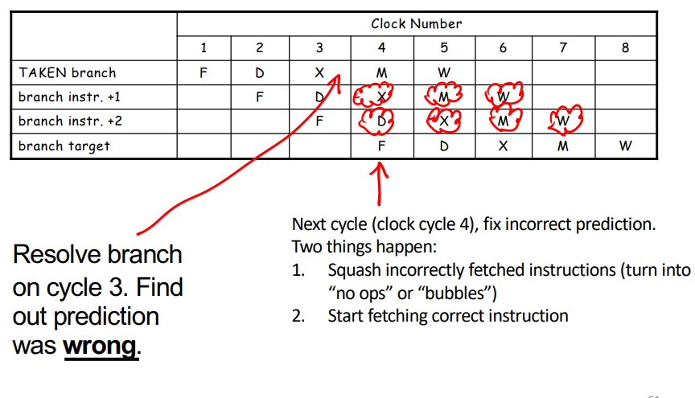

When we realize the mistake, we need to replace all incorrect instructions with "no ops" and begin to getch the correct instruction. More formally:
- Check branch condition in execute stage
- Update PC with correct target by the end of the cycle
- Fetch the correct target in the next cycle

Well, that's as much fucking pipelining I can handle in one day...

# Slide Set 15: Function Calls

Y'know how functions are kinda useful? We're gonna do that shit in ARM now baby.

First things first, define the `C` terminology `extern` and `static`, meaning it can be called anywhere or called only it the current file respectively.

We face many challenges with implementing functions in ARM. For example, if we want to call a method twice, it'd be dumb just to write the code twice. What if make it a branch? That also has issues, since we can't use it in multiple places since the branch can only have one return address. Plus, we get some similar issues when it comes to implementing libraries.

So let's figure out how to do this properly. We have the basic operation of a function call:

1. Put parameters where function can find them
2. Transfer control to the function
3. Acquire storage for function
4. Perform task
5. Put result where calling program can access it
6. Return control to the point of origin (noting
function can be called from many places)

And let's use this to implement the following `C` code:

``` C
/* file: main.c */
extern int leaf_example(int,int,int,int);

void main() {
  int result = leaf_example(1,5,9,20);
  if (result > 10) ... 
}

/* file: leaf.c */
int leaf_example(int g, int h, int i, int j)
{
  int f;
  f = (g + h) – (i + j);
  return f;
}
```

**Put parameters where function can find them**
> To begin, we need to put our parameters somewhere. Easiest solution, registers! ***By convention, ARM uses `R0` to `R3`*** for the first four inputs, so we'll follow that.

**Transfer control to the function**
> We use the Branch and Link Instruction `BL` to transfer control:
> ``` Verilog
> BL ProcedureAddress
> ```
> This sets `R14 (LR)` to `PC + 4` and `PC` to `ProcedureAddress`, so we've effectively given control to the function and stored the return address so we know how to get back. (Recall that `PC + 4` is just the instruction after `BL` since instructions are always 4 bits large, so adding 4 is just the next instruction)

**Acquire Storage**
> We know we have `R0` to `R3` free to use, but what if the function needs more than that? How can we ensure we use other registers without breaking things? The solution? Save things in memory. We have two options here. 
> 
> Either the caller saves backups, or the callee (function) saves the backups.
> 
> Well, if we use the callee, we would push register to the stack and load them later. By convention, the stack is stored in `R13`, so we have the following:
> ``` ARM
> STR r6, [sp,#8] // save register r6 for use afterwards
> ```
> Recall that a stack "grows downwards", meaning we start at higher addresses (0xFFFF) and go down (0xFFFB), We move in increments of 4 since that's how large each address is.

**Perform Task**
> Not much to say here just do the job dumbass function!
>
> Now, we need to restore our backups! Just run:
> ``` ARM
> LDR r6, [sp,#8] // Write sp back to register r6
> ```
> Followed by:
> ``` ARM
>ADD sp, sp, #12 // adjust stack to “delete” 3 items
> ```
> The second part effectively adjusts the stack to "delete" the items we stored in there.

**Put Result where calling Program can access it**
> By convention, ARM returns result by using R0, (and sometimes R0 and R1 if the result is too large), then returning control back to the calling instruction

**Return Control**
> Finally, we just have to run `MOV pc, lr`. If you recall, `lr` stored the original location. So we just set the program counter to the instruction we want and bam we're back!

**Congrats! You wrote a function in ARM!**

But let's go over some conventions:

- Must return result in r0 (overwriting 1st argument)
- Stack point is r13; link register is r14.
- r0−r3, r12: argument or scratch registers are not preserved by the callee (called procedure) on a procedure call.
- First argument in r0, second argument in r1, third argument in r2, fourth argument in r3.
- r4−r11: eight variable registers that must be preserved on a procedure call (if used, the callee saves and restores them)
- Similarly, callee must ensure r13 (sp) and r14 (lr) are restored (if modified, callee saves and restores them)

# Slide Set 16: Fixed Vs. Floating Point

When it comes to decimal values, we have two representations:
1. Fixed Point
2. Floating Point

## Fixed Point

In fixed point numbers, some bits represent digits before the decimal and some represent digits after. This designation of digits is *fixed*, hence the name. Once we pass the decimal place, we start using negative eexponents of 2 rather than the positive ones we've used up to now for values. $2^{-1}$, for example, would represent $\frac{1}{2}$. On the other hand, $2^{-2}$ would represent $\frac{1}{4}$. The issue here, of course, is that our resolution is limited to negative exponents of 2. So unless we use a ton of bits we will have a non-zero degree of error.

With fixed point numbers, addition and subtraction are the same. Multiplication, however, we would have to move the decimal point.

Since bits represent 0s and 1s, it is impossible for us to represent all real numbers, your $\pi$, $\sqrt{2}$ and such. We thus define error for binary represention $x$ of real number $y$ as:

$$
e_{\text{absolute}} = |x-y| \\
e_{\text{relative}} = |\frac{x-y}{y}|
$$

Like mentioned earlier, the ***resolution*** is the smallest difference we can represent. With $2^{-4}$, we have a resolution of 0.0625.

We also define the ***accuracy*** as the maximum possible error over the input range. We also have functions for these, defined as:

$$
a_{\text{absolute}} = \max|x-y| \\
a_{\text{relative}} = \max|\frac{x-y}{y}|
$$

Now, we'll move onto:

## Floating Point

In decimal, we used scientific notation. In binary, we will use the binary equivalent version, defined as:

$$
v = m \times 2^{e-x}
$$

- Where $m$ is the mantissa
- $e$ is the exponent
- and $x$ is the bias

With $a$ bits of mantissa and $b$ bits of exponent we say we have "$a$E$b$" floating point representation.

$m$ is very important to our accuracy. In fact, it practically defines it. If we need less than 1% error, we need 7 bits of $m$! Why? Because 2^-7 represents a value smaller than 1%, so we must have at least that much.

$e$ can be determined in a similar way. If we need to represent a range of exponents from say, -5 to 5, that's 11 exponent values! We can encode 11 exponents in 4 bits, so our $e$ would be 4.

## IEEE Floating-Point Format

To standardize this to a degree, IEEE has a floating point format designated as:

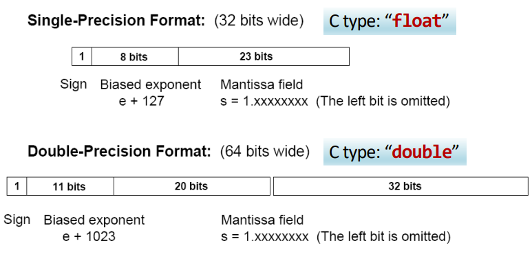

Let's go over this! We'll do Single-Precision format, also known as my goat the `float`. We'll use the number `-6.375` as an example. Let's convert this to a `float`!

We start by writing the number in binary, as so:
> -6.375$_{10}$ = -110.011$_2$

To find our biased exponent, we adjust everything to be in scientific notation:
> -110.011 = -1.10011 * 2$^2$

So our biased exponent is 2! Thus, the term is written as
> e + 127 = 2 + 127 = 129$_{10}$ = 10000001$_2$

Since our number is negative, we make the sign $1$. Then we just add the mantissa, which is just the binary representation of our value with the left bit ommitted. Added together, we get:
> 1 | 10000001 | 100110000....

Similarly, we can convert from IEEE back to decimal. Let's use:
> 0 | 01111100 | 0100...

It's a positive number and the biased exponent is:
> 01111100$_2$ = 124 = 127 - 3

So our biased exponent is -3, the mantissa is 101 which is 5. So we have:
> 5 * 2$^{-3}$ = 0.15625

Not very fun to do without a calculator by the looks of it, but we'll manage.

### Addition
To perform addition with floating points. Normalize it so each operand has the same exponent, perform the operation, and then denormalize so you have a leading 1 at the front of the mantissa.

## ARM Conventions

ARM comes with some instructions for floating point! They are as follows:

- 32-bit FP load: FLDS
- 64-bit FP load: FLDD

- 32-bit FP store: FSTS

- 32-bit FP Addition: FADDS
- 64-bit FP Addition: FADDD
- 32-bit FP Subtraction: FSUBS
- 32-bit FP Multiply: FMULS
- 32-bit FP Divide: FDIVS

# Slide Set 17: Hardware Interfaces

As we build and use more hardware, it will become abundantly obvious that we will have yet more issues with timing. Hardware blocks that process data will have a propagation delay. Hardware blocks that represent sequential modules rely on clock cycles, so clock cycle delay also play a role.

How then, do we know when its safe to **make a request** and to **read a response** from a hardware block?

Some blocks have fixed delays, which make it easier, but what if a block has multiple different delays? Like an `ADD` operation on an ALU that takes longer than a `MOV` instruction? We have some options:

**Easy Solution**
- Wait for the longest possible delay, but this'll slow things down

**Hard Solution**
- Know specific delay for each opration, but this is hard to program and has risks

Maybe there's a better way than these two? If we really think about, this is a problem of permissions. We need to know when we have permission to read or write to a hardware block. So why not just have the hardware block tell us if its okay yet?

All we need to do is add such a control to our Controller! An extra 1 bit signal from the hardware block that tells us when its okay to read/write and when its not.

With this, we can also add a **Credit-Based Interface**. The Consumer hands out credits to users of it as long as it hass buffer space. Users use credits to send requests until they run out. As users send data to the Consumer, the consumer periodically sends back credit replishments. This has many benefits. For example, the user is always aware of the current situation at the consumer.

# Slide Set 18: ASCII, Pointers, Structs, 2D Arrays

Commonly, we use ASCII and UNICODE. ASCII uses 8 bits per character while UNICODE uses 16 bits.

## Copying Characters

8 bits a byte in Hexadecimal corresponds to 2 hexadecimal digits. Since a memory location contains 4 bytes. If we want to copy a single character we need to somehow copy just the first two digits of a memory address. To do this, we can use:

``` ARM
LDR R1,[R0,#0] // R1 = 6C6C6548
MOV R2,#255 // R2 = 000000FF
AND R1,R1,R2 // R1 = 00000048
```
This bit of code simply uses `0x000000FF` to AND the last two digits, which is what we want.

## Signed Load

If we read a 8-bit value from memory which represents a number in 2's complement. We need to sign extend the unused bits, so just append that with as many `FFFFF`'s as you want.

## A bit on Arrays:

We can convert the following `C` code of clearing an array:

``` C
clear1(int array[], int size)
{
  int i;
  for (i = 0; i < size; i += 1)
    array[i] = 0;
}
```

To ARM:

``` ARM
MOV R2,#0 // i = 0
MOV R3,#0 // zero = 0

loop1: 
  STR R3, [R0,R2, LSL #2] // array[i] = 0
  ADD R2,R2,#1 // i = i + 1
  CMP R2,R1 // i < size
  BLT loop1 // if (i < size) go to loop1
```

Here, we use the `STR R3, [R0,R2, LSL #2]` which says store `R3` to `R0 + R2 << 2`. We bitshift left twice to multiply by 4 to get to a new array index.

We can also use pointers to implement this. Pointers are really just variables containg memory addresses. Nothing more than that, really/

``` ARM 
MOV R2,R0 // p = address of array[0]
MOV R3,#0 // zero = 0
ADD R4,R0,R1,LSL #2 // R4 = address of array[size]

loop2: 
  STR R3,[R2],#4 // Memory[p] = 0; p = p + 4
  CMP R2,R4 // p < &array[size]
  BLT loop2 // if (p<&array[size]) go to loop2
```

Here, the main difference is using `STR R3,[R2],#4`, where `R2` now just contains the memory address of the index in array, and the `#4` just adds 4 to `R2` every iteration! That seems a lot cleaner!

## The Heap?
Idk why this is here. Idk when we use the heap. All the slide says is that the memory address of the heap grows up while the stack's grows down. That's it. That's all I got.
> There is one major benefit, and that's that the heap can grow dynamically upwards unlike the stack which is fixed by its starting point. The stack must stop at 0, but the heap? It can keep going on!

## C Strucutres and Linked Lists
A cmommon data strucutre for holding arbitrary amounts of data is a linked list. All a linked list is:

``` C
struct Node {
  int value;
  struct Node *pNext;
}
```
Where each node holds a value and the next Node given by its memory address.

## 2D Arrays

So... Memory is one long linear list. How do we now get a 2D array in this? We can convert the indices `i` and `j` to addresses through two methods:

- Addr$_{Row Major}$ = base + (i*size(row) + j)*size(elem)
- Addr$_{Col Major}$ = base + (j*size(col) + i)*size(elem)

`C` uses row major for 2D arrays. But, you basically just follow the formula to a tee to calculate the address for an element in the 2D array. Nothing too fancy.