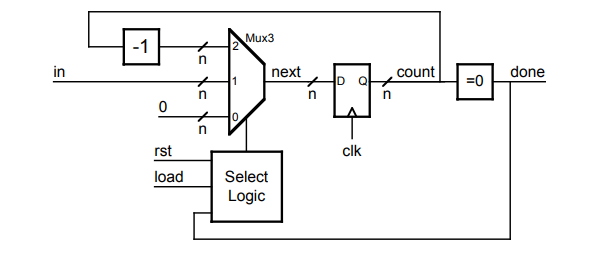
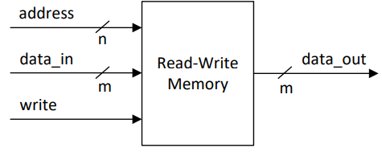

# **CPEN 211: chat im cooked**
### November 5 2024

## Timer Module


We can make this circuit in Verilog with:
``` Verilog
module Timer(clk, rst, load, in, done) ;
     parameter n = 4 ;
     input clk, rst, load ;
     input [n-1:0] in ;
     output done ;
     wire [n-1:0] count, next_count ;
     wire done ;

     vDFF #(n) cnt(clk, next_count, count) ;

     always @(*) begin
        casex ({rst, load, done}) // turn everything into a Bus
            3'b1xx: next_count = 0 ; // reset
            3'b001: next_count = 0 ; // done
            3'b01x: next_count = in ; // load
            default: next_count = count - 1'b1; // count down
        endcase
     end

     assign done = (count == 0) ;
endmodule
```
look man this looks pretty self explanatory i hope u can figure it out lil bro.

## Read-Write Memory
Also called **Random Access Memory (RAM)**
- ram my beloved

Recall:
- Memory composed of large number of locations that can
be uniquely identified and can store a value
- Location is uniquely identified by its “address”
- Total number of locations is called “address space”
- Number of bits in each location is “addressability”
  
RAM supports two operations
- Read a value from a location
- Write a value to a 

### What does a RAM module look like?



To write, we need to know: 
- the address to write to (`n` number of addresses)
- the data we're sending in (`data_in` and its width)
- a signal telling the memory to write

### How do we implement Memory on the DE1-SOC?
The code below takes advantage of memory on the DE1-SOC, so this mothod should really only be used for that board. 
``` Verilog
// To ensure Quartus uses the embedded MLAB memory blocks inside the Cyclone
// V on your DE1-SoC we follow the coding style from in Altera's Quartus II
// Handbook (QII5V1 2015.05.04) in Chapter 12, “Recommended HDL Coding Style”
//
// 1. "Example 12-11: Verilog Single Clock Simple Dual-Port Synchronous RAM
// with Old Data Read-During-Write Behavior"
// 2. "Example 12-29: Verilog HDL RAM Initialized with the readmemb Command"
module RAM(clk,read_address,write_address,write,din,dout);
 parameter data_width = 32;
 parameter addr_width = 4;
 parameter filename = "data.txt";
 input clk;
 input [addr_width-1:0] read_address, write_address;
 input write;
 input [data_width-1:0] din;
 output [data_width-1:0] dout;
 reg [data_width-1:0] dout;
 reg [data_width-1:0] mem [2**addr_width-1:0];
 initial $readmemb(filename, mem);
 always @ (posedge clk) begin
 if (write)
 mem[write_address] <= din;
 dout <= mem[read_address]; // dout doesn't get din in this clock cycle
 // (this is due to Verilog non-blocking assignment "<=")
 end
endmodule
```

## Multiplier
It's like an adder, but it multiplies two numbers! Logically, its logical to see how we can go from adders to multipliers. For now, let's assume they're magic black boxes.

Can we calculate exponents? Yes! We simply have to take a multiplier and stick it to another a multiplier to keep stacking multipliers. However, what if we don't know what the exponent is? What if we can't use an arbitrary number of multipliers? We can tackle this with some pseudocode:

``` c
P = 1; // where P is the base
CNT = A - 1; // Counter
// A is the exponent

while(CNT >= 0) do
    P = P * X;
    CNT = CNT - 1
end while;
```

Time to introduce a new Synthesis Rule! **A piece of synthesizable Verilog code can only describe what happens in one clock cycle.** As such, we cannot synthesize the above pseudocode in Verilog.

