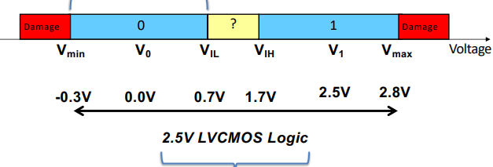
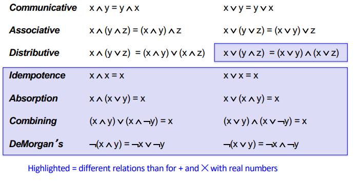
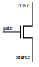
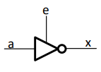
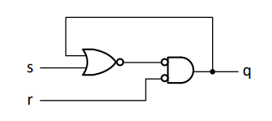
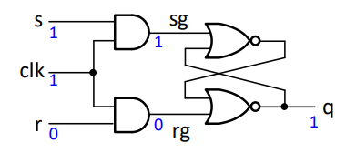
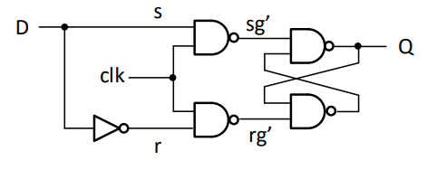

# CPEN 211 Midterm Review

### October 9 2024

# Slide Set 1: From the Beginning

## Keeping things smooth in Binary

The goal of this class, in its most simple form, is to convert real world problems to those that can be represented by digital hardware and software. As such, we take a lot of real world inputs and convert them to digital form. One major problem, then, is ensuring data is read correctly.

- Binary gives us an advantage by effectively *casting* any noise that an analog signal can produce into a binary one, thus reducing the effectiveness of noise.

To reduce noise further, we can use what's called a **Buffer**. In essence, buffers allow for a wide range of inputs of `0` and `1` but very narrow outputs of `1` and `0`. This way, noisy inputs can be converted to noiseless outputs.



We always have a $V_{min}$ and a $V_{max}$, which represent the lowest and highest amount of voltage that won't damage the circuit. We also have $V_1$ and $V_0$, which represent the ideal values of `1` and `0`. Finally, we have $V_{IL}$ and $V_{IH}$, which represent the max and min values of the region considered `0` and `1` respectively.

## Data Representations

All of our data representation will be done using binary, but *how* we use binary is still up to us. Our Binary representation can be very tedious or very clever depending on how we choose to represent things!

## Types of Digital Logic

**Combinational Logic**
- Logic where present output is a function of present input. Past values do not matter

**Sequential Logic**
Past outputs and present inputs are required for new output

## Boolean Algebra

Luckily for us, we already know a lot about boolean algebra! Let's review some special things though:

**Perfect Induction:**
- Prove two things are equal by proving every possible case. For our purposes, this means proving logic statements equal via complete truth tables.

**DeMorgan's Law**
- $\neg(x\wedge y) = \neg x \vee \neg y$
- Yeah, that's it, not much else for that.

## Principle of Duality

If a boolean equation is true, substituting every $\wedge$ for $\vee$, 1 for 0, and vice versa will also create a true equation.

One thing to note about dual functions:
- $f^D (\overline a,\overline b,...) = \overline{f(a,b,...)}$

We should also note the following:


Just for future reference.

## Truth Tables to Equations

We can reduce Truth Tables to Logic Equations through what we call a Normal Form. There are two types of Normal Forms:

(Recall that Sum means OR and product means AND)

**Sum of Products**
- Where every term represents a `1` output in the Truth Table and are OR'd together. All inputs in a term are AND'ed together and inputs that are `0` are complemented.


# Slide Set 2: We doing Circuits now

## Transistors

All implementations of gates are constructed out of two types of Transistors:

**NFET**
- When NFET gates are given 2.5V, they close and begin to act like a wire, effectively like an ON switch that's activated by Voltage. We draw NFET gates as:
- 
- Now, NFET's work because we can connect the output to ground. In this way, we can control the current flow into output. However, this means the NFET must be fed *constant voltage*. To solve this energy consumption error, we'd ideally put the switch from supply to output.

Okay, but why can't we just use an NFET for supply to output? Well, NFET gates have a *threshold voltage* $V_{th}$. This threshold voltage is added to whatever value we want. If output `1` is 2.5 Volts and $V_{th}$ is 0.7 Volts, then we need to pass 3.2 Volts to the NFET. But since our voltage is limited to 2.5 V. In practice we'd have to use 1.8 V as `1`, which increases noise. So to reduce noise, we cannot use NFETs.

To solve this issue, we introduce:

**PFET**
- PFETs are exactly opposite to NFETs. They open when given a supply voltage and are normally closed. This is exactly what we want for our supply to output situation!

Now, the combination of these two create our full gate implementation

What's important to remember is that our original signal is **not** being parsed to the output when using transistors. Instead, our original voltage input is being used to control the transistors, whereas a separate voltage and ground provide the output.

Using PFETs and NFETs, we can create any arbitrary boolean function. To accomplish this, PFETs use a *Pull-Up Network* and NFETs a *Pull-Down Network*. 

- So we take some function $f(a.b)$ and from there we find its negation $\overline{f(a,b)}$. We implement this directly into the NFETs.
- Next, we take the dual of our negated function $f(\overline{a}, \overline{b})$, and implement this into our PFETs.
- Simple enough, right?

## Tri-State Inverter



This lil guy! He acts like a normal NOT gate when `e = 1` and is disconnected when `e = 0`.


# Slide Set 3: Optimizing Logic

## Terms and Definitions
**Minterm**
- A product term that includes each input of a circuit or its complement. Represents a single ow in a truth table.

**Implicant**
- A product term that is true only when the boolean function is true. In other words, this product term being true *implies* the function is true.

## KMAPs

Admittedly not much to actually write here, but we'll go over some details:

- Remember that all covers must have sides of length $2^n$.
  - Why is this the case? KMAPs work off of the basis of boolean logic laws. We can reduce two terms to one term, but we can't reduce 3 terms to one term. Hence, we need to work in powers of 2.
- When there are impossible input combinations, we implement what we call "don't cares".
- Corners can wrap to other corners! Pretty cool!
- If there are more `0s` than `1s`, we can instead use a Product-of-Sums KMAP. Here, all variables that are fully enclosed in a cover are `0`, all variables that aren't are `1s`. The terms are OR'ed together and each implicant is AND'ed together.
- Hazards occur when covers are close but not overlapped, **make sure all covers overlap at some point.**

# Slide Set 4: More Combinational Logic

**One Hot Representation**
- In One-Hot code, each bit represents a different state unlike Binary.
- How do we convert from binary to One Hot then?

## (De-)Encoding

**Decoder (Binary to One-Hot)**
- Converts a symbol from one code to another
- Used to construct memory

Just like everything else, we can build truth tables and KMAPs for decoders to figure out how to build one. If you want to go from 2 bits of Binary to 4 bits of One-Hot, just figure out how to build the circuit!

The opposite of a Decoder is obviously a:

**Encoder (One-Hot to Binary)**
- Inverse of a decoder
- Not much else to say here

Larger Decoders and Encoders, like 2:4, 4:8, etc. can be built out of smaller decoders that we have already made.

## Multiplexers

- Multiplexers allow you to select inputs! For a multiplexer, we take 1 more input than we need. For example, a Multiplexer with 2 inputs would have 1 for the first, 1 for the second, and 1 to represent the input that switches which input we want (called select).
- We can choose to build Multiplexers with either Binary or One-Hot selects.

# Slide Set 5: Welcome to Sequential Logic

The first thing we should talk about is the almighty RS Latch:

**RS-Latch**



- A simple circuit that can hold a value based on inputs of r and s. Not very useful.

**Gated RS-Latch**



- Adds a clock signal. Behaves like a normal RS-Latch when `clk` is high and maintains its value regardless of `r` and `s` when `clk` is low.

**D-Latch**



- If `clk` is high, output is equal to `D`
- If `clk` is low, output holds value

For the purpose of our class, we will focus on **(Rising) Edge-Sensitive D-Latches** to avoid thinking about delays and hazards.

## Finite State Machine

When designing a finite state machine, do the following
1. Choose your State Representation (One-Hot or Binary)
2. Build a Truth Table including present state, inputs, next state, and outputs
3. Find a Kmap for each bit of next state and outputs separately.
4. Design circuits for outputs and next state
5. Feed next state into a Flip-Flop to preserve its value. Loop this value back into the inputs as needed.

# Slide Set 6: Verilog Begins...

First things first, Verilog is NOT a programming language. It is a Hardware Description Language. Imagine we are writing what the hardware does instead of writing how to do it.

In Verilog, we have synthesizable Verilog and full Verilog, Synthesizable is what we can actually build out of circuits! The rest is simply for simulation, not actually hardware design.

The basic form of a system in Verilog is built using a **Module**. In a module, we declare inputs, outputs, internal signals, and logic definitions.

With that out of the way, let's take a look at some...
## Verilog Syntax

- `.v` -  File extension for Verilog
- `.sv` - Extension for SystemVerilog. We will use this one.

Boolean Expressions:
- `&` - AND
- `|` - OR
- `~` - NOT
- `^` - XOR
  
We can instantiate logic through a continuous assignment, written as:
``` Verilog
    assign <wire> = <expression (with wires or regs)>;
```

We might use it like:

``` Verilog
module AND_GATE(a, b, c);
    input a, b;
    output c;
    assign c = a & b;
endmodule
```

In this way, a majority circuit might be:

``` Verilog
module Majority(a, b, c, out) ;
    input a, b, c ;
    output out ;
    assign out = (a & b)|(a & c)|(b & c) ;
endmodule
```

An Important thing to remember is that modules are not like Functions. They behave more like a NAND or NOT chip we might find on our breadboard.

We express numbers using:
``` Verilog
<size>’[<signed>]<radix>value
```

- `size` refers to the number of bits
- `radix` refers to the type:
  - b - binary
  - d - decimal
  - o - octal
  - h - hexadecimal
- `value` simply the number. Underscores ignored

So a number might look something like `2'b01` for 1 in binary.

Buses are described by `wire [2:0] x;`
