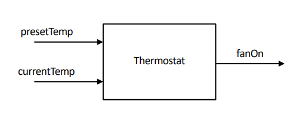

# **CPEN 211: Verilog Time!**
### October 1 2024

## Buses in Verilog

We represent buses in Verilog with:
``` Verilog
wire [2:0] X;
```
This defines X as a bus with 3 parallel wires. In this case, the rightmost bit is index 0, the leftmost index 2, and figure out the middles idk man.

Indices are declared implicitly, so `wire [3:11]` would declare the busses with indices 3-11.

Things to do with busses:

1. You can assign values to all elements in the array at once
``` Verilog
    wire [7:0] x;
    assign x = 8'b00011101
```
2. You can copy one bus to another (more on this later):
``` Verilog
    assign out_bus = in_bus;
```
3. You can access individual elements (wires):
``` Verilog
    wire STATUS;
    wire [15:0] MAIN_BUS;
    ...
    assign STATUS = MAIN_BUS[15];
```
4. You can access subranges of busses:
``` Verilog
    wire [31:0] MAIN_BUS;
    wire [3:0] OPCODE;
    ...
    assign OPCODE = MAIN_BUS[31:28] // Slice notation, inclusive of boundaries
```
We read buses from left to right regardless of the ordering of the indices. For example, `[31:0]` is read from 31 as the first index and 0 as the left

## **Examples of copying Busses**

``` Verilog
// Example 1
wire [7:0] out_bus;
wire [7:0] in_bus;
...
assign out_bus = in_bus;

// Example 2
wire [7:0] out_bus;
wire [15:8] in_bus;
...
assign out_bus = in_bus;
```
In this case, `out_bus[0] = in_bus[8]`, `out_bus[1] = in_bus[9]`, so on and so forth.
``` Verilog
// Example 3
wire [7:0] out_bus;
wire [0:7] in_bus;
...
assign out_bus = in_bus;
```
In this case, `out_bus[0] = in_bus[7]`, `out_bus[1] = in_bus[6]`, so on and so forth.
``` Verilog
// Example 4
wire [7:0] out_bus;
wire [15:0] in_bus;
...
assign out_bus = in_bus;
```
In this case, the two busses are of different sizes. This is not an issue. We copy like normal from the right until we run out of space in `out_bus`. Effectively, this code behaves like:
``` Verilog
wire [7:0] out_bus;
wire [7:0] in_bus;
...
assign out_bus = in_bus;
```
Where we copy values of `in_bus` up to the maximum value of `out_bus.`
### **Important Case:**
``` Verilog
// Example 5
module bus_test(a,b);
    input [7:0] a;
    output [7:0] b;

    assign t = a;
    assign b = t;
endmodule
```
We haven't told the compiler what `t` is, so how does this code even compile? The compiler, genius that it is, decides to automatically declare `t` as a one bit variable. Be careful with this!

5. Concatenate short vectors to produce longer ones using `{a,b}`

    Example: if the following two signals are defined:
``` Verilog
    wire [3:0] ERROR_CODE;
    wire [7:0] MAIN_BUS;
```
- Then the following assignments are legal:
``` Verilog
    assign MAIN_BUS = {4'b0000, 4'b1111};
    assign MAIN_BUS = {4'b0000, ERROR_CODE};
    assign MAIN_BUS = {1'b1, 7'b0000000};
    assign MAIN_BUS = {1'b1, 1'b0, 1'b1, 1'b0, 1'b1, 1'b0, 1'b1, 1'b0};
    assign MAIN_BUS = {1'b0, ERROR_CODE, 3b'111};
    assign {ERROR_CODE,MAIN_BUS} = 12b’111110101010;
```

6. You can make copies of one or more bits using the replication operator `{k{n}}`, which copies `n` `k` times

``` Verilog
    wire [1:0] x = 2’b10;
    wire [7:0] y = {4{x}}; // y = 8’b10101010; {k{n}} makes k copies of n
    wire [8:0] z = {3{x,1’b0}}; // z = 9’b100100100; combined w/ concat.
```
7. You can make two dimensional arrays:
``` Verilog
    reg [3:0] data [7:0] // data contains 8 elements of 4-bits each
```
We could have used "wire" and not "reg, but we will use reg because assignments to memory are made in an "always" block. *Inside an always block*, you could write:
``` Verilog
    data [7] = 4'b0011;
```
8. You can write bitwise Boolean expressions:
``` Verilog
    wire [3:0] result = A & B;
    // result[0] = A[0] & B[0]; result[1] = A[1] & B[1];
```

### **Boolean Expressions Revisited:**
- When applied to two operands, **&** , **|** , **^** are "bit-wise"
- Bitwise means the operators operate individually on each bit in a bus
- also **~** is bitwise

9. You can `OR` or `AND` together bits using:
``` Verilog
    wire result = |A; // result = (A[0] | A[1] | A[2] | … A[n-1])
    wire foo = &A; // foo = (A[0] & A[1} & A[2] & …. A[n-1])
```

## **Thermostat Revisited:**
  

So let's make some example code:
``` Verilog
module Thermostat(presentTemp, currentTemp, fanOn);
    input [2:0] presetTemp, currentTemp;
    output fanOn; // will be wire by default
    wire fanOn;
    assign fanOn = (currentTemp > presetTemp);
endmodule
```

One of the nice features of Verilog is that we can be as unoptimized as we want (okay don't actually be that unoptimized). Verilog will basically automatically do KMAPs for us and optimize our logic into a circuit.

### **Verilog's `Define`**

In Verilog, we have constants like other programming languages represented by:
``` Verilog
`define <macro_name> <macro_text> // DO NOT put semicolon on the end!
```
Example:
``` Verilog
`define Sa 2'b00
```
This code means the variable `Sa` has the value `2'b00`, forever and ever.

### **Verilog's Conditional Operator**
``` Verilog
<cond_expr> ? <true_expr> : <false_expr>
```

Meaning: If `<cond_expr>` is true, then the value of the entire expression is the value given by `<true_expr>`. Else, the value is given by `<false_expr>`. Effectively an `if statement`

Example:
If “in” is 1, then value of (in ? \`Sb : Sa) is `Sb

**So a Multiplexer in Verilog is:**
``` Verilog
wire [1:0] b = select ? A0 : A1;
```

### **Majority Gate**

``` Verilog
`define Unanimous 3'b111
module Majority( input [2:0] val, output out ) ;
    assign out = (val==`Unanimous) ? 1'b1 :
                 (val==3'b110) ? 1'b1 :
                    (val==3’b101) ? 1'b1 :
                        (val==3'b011) ? 1'b1 : 1'b0 ;
endmodule
```

## **The Always Block**
Two important things to know:

1. What an always block is (syntax and meaning)
2. *Rules* to ensure your always block Verilog code is *synthesizable* by CAD tools.

The Always Block allows us to describe the function of a circuit without actually describing the hardware. Describing behaviour through english is ambiguous, so we turn to Always Block syntax to help us describe behaviour.

```Verilog
always @(<sensitivity_list>) begin
<sequence of statements in which order matters>
end
```

- Each always block describes the function of one block of hardware
- When a signal in the **Sensitivity List** changes, statements inside the always block are evaluated one after another in order.
- Sensitivity list is a light of signals separated by commas ( , ), "or", or asterisks ( * ).
- The **Sensitivity List** is not to be confused with input parameters as one might find in a language like Java. Nothing is passed into the Always Block, it just determines *when* the block will be evaluated.
- If only one statement is in the block, we can omit the `begin` and `end`.

### **What goes inside an Always Block**

- **For CPEN 211, `if`, `case`, `casex` statements! Do NOT use loops in always blocks!**
- Use "begin" and "end" to group statements
- Signals modified in an always block **Must** be declared as `reg` and not `wire`. This is a syntax rule, changes nothing about behaviour.
  - Okay it gets a lil more confusing. Things that are declared must use `reg`. Things that are read can use `wire` or `reg`. As in `reg x = wire a` is legal.
- Always Block outputs modified using "=" or "<=".
- Do NOT use assign statements inside always block.

### **If Statement**

``` Verilog
if (<condition expression>)
    <statement>
else <statement> 
```

Notes:
1. Need to wrap `<statement>` in begin/end for multiple statements.
2. When describing combinational logic using if statement need to include “else”.

### **Case Statement**
``` Verilog
case (<selector>)
 { <label list> : <statement> }+
 default: <statement>
 endcase
```
1. Need to wrap <statement> part in begin/end pair if you want multiple statements.
2. When describing combinational logic with case statement need to include default (Why? See synthesis rules later in slide set).