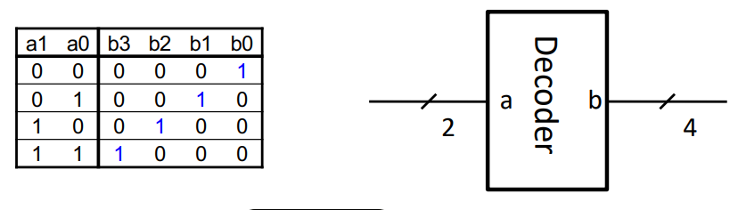
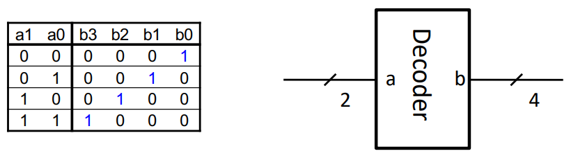
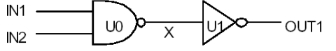

# **CPEN 211: Verilog Time! Part 2**
### October 3 2024

### **Verilog Implementation of a 2:4 Decoder**



Okay let's get this started:

``` Verilog
module Dec24(a,b);
    input(1:0) a;
    output(3: 0) b;

    assign b[0] = a ~a[1] & ~a[0];
    assign b[1] = a ~a[1] & a[0];
    assign b[2] = a a[1] & ~a[0];
    assign b[3] = a a[1] & a[0];
endmodule
```

Now, this is a little complex so we can instead use:

``` Verilog
module Dec24(a,b);
    input(1:0) a;
    output(3: 0) b;
    wire [3:0] b = 1 << a;
endmodule
```

Here, we instead used a bitshift. Take a look at the first row in the Truth Table, `a = 0` so we shift `1` by 0 bits into `b`, which is just `0001`. Similarly, the `1` is shifted 1 bit when `a = 1`.

### **Let's try Encoders!**



| a1 | a0 | b3 | b2 | b1| b0 |
|----|----|----|----|----|----|
| 0 | 0 | 0 | 0 | 0| 1 |
| 0 | 1 | 0 | 0 | 1| 0 |
| 1 | 0 | 0 | 1 | 0| 0 |
| 1 | 1 | 1 | 0 | 0| 0 |


Let's try this:

``` Verilog
module Dec24(a, b) ;
    input [1:0] a ;
    output [3:0] b ;
    wire [3:0] b = 1 << a ;
endmodule
```

### **Let's try Multiplexers!**
``` Verilog
// 1-bit 2-input mux with one-hot select
module Mux2a(a1, a0, s, b) ;
    input a0, a1; // inputs
    input [1:0] s; // one-hot select
    output b ;
    assign b = (s[0] & a0) | (s[1] & a1);
endmodule
```

We also have:

``` Verilog
// 2-bit, 3-input mux with one-hot select
module Mux3_2(a2, a1, a0, s, b) ;
    input [1:0] a0, a1, a2; // inputs
    input [2:0] s ; // one-hot select
    output[1:0] b ;
    assign b =  ({s[0],s[0]} & a0) |
                ({s[1],s[1]} & a1) |
                ({s[2],s[2]} & a2) ;
endmodule
```
Or, y'know, perhaps more intuitively:

```Verilog
module Mux3a(a2, a1, a0, s, b) ; input [7:0] a0, a1, a2 ; // inputs
    input [2:0] s ; // one-hot select output[7:0] b ; reg [7:0] b ;
    always @(*) begin case(s) 3'b001: b = a0 ;
    3'b010: b = a1 ;
    3'b100: b = a2 ; default: b = {8{1'bx}} ; endcase
    end
endmodule
```

## Verilog Syntax Module Instantiation

Let's consider a simple example:



We can express each gate as a module:

``` Verilog
module NAND_GATE(A,B,Z);
    input A, B;
    output Z;
    assign Z = ~(A & B);
endmodule

module INV_GATE(A,Z);
    input A;
    output Z;
    assign Z = ~A;
endmodule
```
### Instantiation Syntax

``` Verilog
<module name> <instance name>(<port list>) ;
```

- `<module name>`: name of the module.
- `<instance name>`: name of this instance of the module.
- `<port list>`: list of signals connected to inputs and outputs of module.
    
- Module output ports ***must*** be connected to wire where they are instantiated
  - AKA Outputs must be wire
- Module input ports can be connected to either a reg or wire
  - AKA Inputs can be wire or reg

``` Verilog
module AND_GATE (IN1, IN2, OUT1);
    input IN1, IN2;
    output OUT1;
    wire X;
    NAND_GATE U0 (IN1, IN2, X);
    INV_GATE U1 (X, OUT1);
endmodule
```

In this case, our code would still work as expected even if `INV_GATE` and `NAND_GATE` swapped positions. Modules are not the same as function calls and do nto depend on order in the same way.