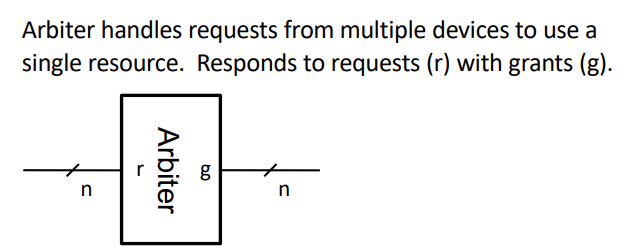

# **CPEN 211: Verilog Time! Part 3**
### October 8 2024

## Iterative Circuit Design

## Arbiter


c<sub>i</sub> = 0 have seen r(j) = 1, j = 1
(n<sub>i</sub>)  = 1 have NOT seen a request (j < i)

| r<sub>i | n<sub>i | g<sub>i | n<sub>i+1</sub> |
|-|-|-|-|
|0|0|0|0|
|0|1|0|1|
|1|0|0|0|
|1|1|1|0|

We can implement an arbiter using:
``` Verilog
module ArbStage(r, cin, g, cout) ; input r, cin ; output g, cout ;

 assign cout = ~r & cin ; assign g = r & cin ; endmodule
```
A 4 bit one may be:
``` Verilog 
module Arb(r, g) ; input [3:0] r ; output [3:0] g ;
 wire [4:0] c ;
 assign c[0] = 1’b1; ArbStage stage1(r[0], c[0], g[0], c[1]);
 ArbStage stage2(r[1], c[1], g[1], c[2]);
 ArbStage stage3(r[2], c[2], g[2], c[3]); ArbStage stage4(r[3], c[3], g[3], c[4]); endmodule
```

But we can do it better:

``` Verilog
module Arb(r,g);
    input [3:0] r;
    input [3:0] g;
    input [3:0] c;

    assign c[0] = 1'b1;
    assign c[1] = ~r[0] & c[0];
    assign c[0] = ~r[1] & c[1];
    assign c[0] = ~r[2] & c[2];

    assign g = r & c;
```
More generally for a n bit arbiter, we can just do:

``` Verilog
module Arb(r, g) ; 
    parameter n = 4 ;
    input [n-1:0] r ; 
    output [n-1:0] g ;
    wire [n-1:0] c ; 
    wire [n-1:0] g ;
    
    assign c = {(~r[n-2:0] & c[n-2:0]),1'b1} ; 
    assign g = r & c ;
endmodule
```