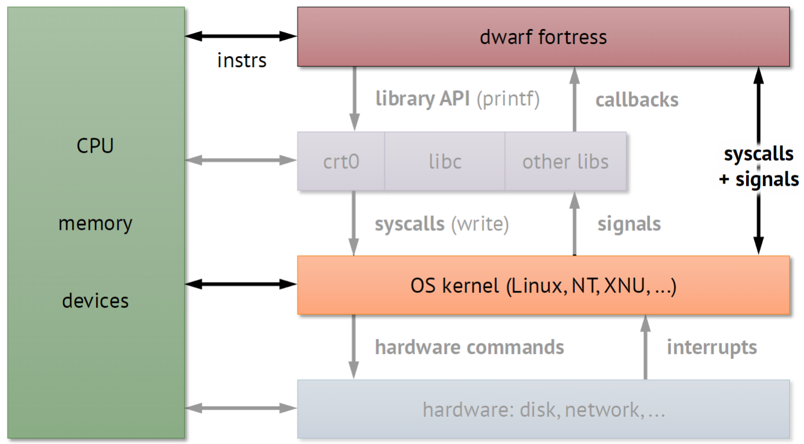

# CPEN 212: Procedure Call Abstraction

## Introductions:
- There will be a quiz every class, based on the content from the previous class
- High probability there will be 6 labs
- HOLY SHIT WE DON'T ACTUALLY HAVE TO GO TO THE LAB
- apparently we're not supposed to plagarize idk man sounds weird

## The class begins:

### The Pipeline:
We learnt last semester how the CPU takes instructions and spits results. But obviously, there is a lot more than that to a computer:

**Library APIs** allow us to easily access common functions. They're simply packets of instructions to the CPU that are common, like `printf` and `malloc`, for example.

**Operating System Kernels** like Windows and Linux serve one major purpose: To ensure the safe execution multiple programs. For example, the OS would prevent two programs from say—modifying each other's memory. The **Hardware** is also important to isolating the the OS from other programs.

> **If Libraries and the OS are both important, why seperate them?**
> 
> Well, technically, we don't need to! This is a design by convention. 
> It does have benefits, like for example, a user can have an OS that fits most needs, but can also download extra libraries without reinstalling an entire OS.
> Similarly, it might be incovenient to use a barebones OS where even the GUI is a library that needs seperate, standalone installation.

**Interrupts** are unexpected changes to instruction calls. A user making a keyboard input, the sudden arrival of a network packet, these are all cases where the CPU needs to change program execution based on random information. Typically, hardware like Network Cards and IO devices are the ones sending interrupts.

**Signals** are how the OS communicates information to Libraries, like interrupts! When we're talking from Libraries to the Application, this is called a **Callback**.

