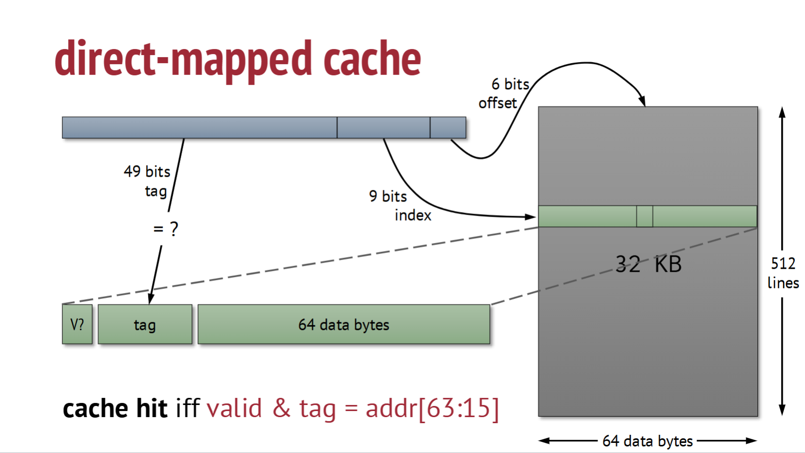
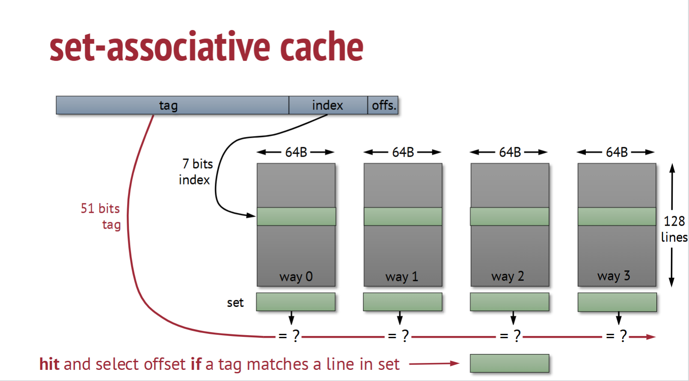

# CPEN 212: Caches

## Direct-Mapped Cache

We use 9 bits to decide which line to index into (9 bits represents 512 indices). Since we have 64 bytes, we have a 6 bit offset (2^6 = 64) to index into each specific data butes. Finally, a 49 bit tag composesd the rest of the address. Why do we need the tag? Since all caches share the same structure with the first 9 + 6 bits, we have a tag that tells us which speicifc cache we point to. Finally, we have a 1 bit tag that represents validity.

The problem with a direct-mapped cache is conflict. Indices can overlap, and with completely random indices, we have a 50% chance of overlap! That's insane. We need to try something else:

## Set-Associative Cache

Now, we seperate our 512 lines into four 128 lines sets. Since we have less roles, we can now use a 7 bit index to index into a specific set. Then, we just search through the set untill we find a matching tag. 

## Eviction Policy

How do we get rid of something in the cache? If we could predict the future, then we could evict the item that is referenced the furthest in the future. However, since we can't predict the future, we use the **Least-Recently Used** or **random** policy to evict items.

## How do we use Caches efficiently?

**Lay out** data accessed together inside one cache line.

Reuse data in chunks **that fit in the cache**

We will be using **Matrix Multiplication**. This is the method we will use in Lab 6:

**Key Idea?** Find matric indices constant across a loop

$$ ∀ r, c: z [r, c] ← \sum_i^N x[r, i] ∙ y[i, c] $$

