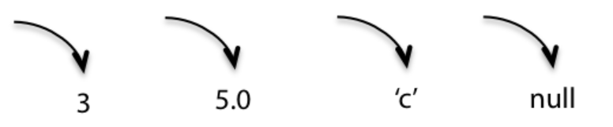
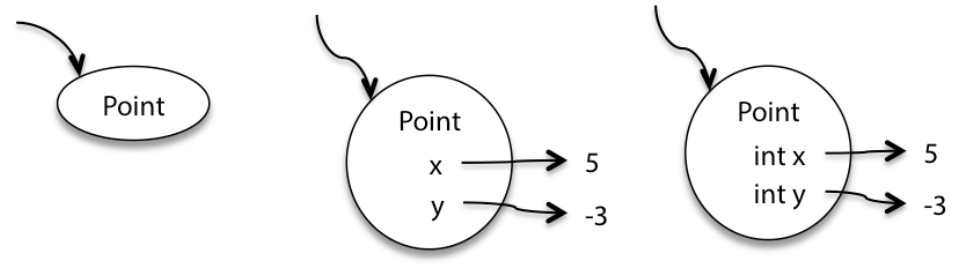
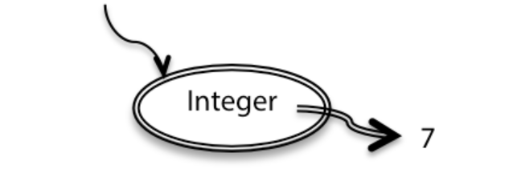

# Module 1: Static Types, Specifications, and Testing

## CN2.1. The Need for Types

Primitive Type:
- A type supported directly by our Language

Type (Formally):
- A set of values and the operations permitted on the values.

When we create a Type via Classes, we can specify its parameters via the constructor, which runs automatically upon creation of an object.

Types also introduce redundancy. It would be very hard to say `Date` = `String` because the two types are inherently incompatible and caught by the Compiler.

## CN3.1 The Need for Specifications

Consider:
``` java
x = x + 10
```

On its own, all we can say about this code is that x_new = x_old + 10. This is called the **Postcondition**. On the other hand, **Preconditions** are what we know about the data beforehand. These are very helpful to analyzing programs.

When reasoning about programs, we always want to find the most specific postconditions.

On the other hand, we want to know the most broad statement for preconditions

In other words, we want to know exactly what code outputs and also know just how many different things we can use as inputs.

That leads us to **Specifications**, a contract where if the preconditions are met, so will the postconditions.

We use specifications to bridge understanding to clients of our code. Nobody wants to read our source code so we simplify that process by telling them exactly what they need to input and exactly what they'll get. Specifications also allow us to modify programs well. As long as both our and the clients programs follow the specification, we can change the implementation of the method however we'd like.

`null` Values are a troublesome bit of code since any object can take on a value of null. Java, however, won't catch onto `null` errors until runtime, so bugs from these are hard to catch and `nulls` should never be allowed as parameters or return values, unless explicitly stated (still a bad idea tho).

Specifications should **never** discuss local or private fields of the method or its class. The implementation does not matter. The specification is concerned only with inputs and outputs.

## CN6.1 Exceptions

Sometimes, unintended behaviour from code can cause serious problems. To curb this, we use **Exceptions**. Exceptions can come with try-catch blocks, which try to run some program and switches to another bit of code in case the first throws an exception

There are two types of Exceptions:

**Checked**
- Checked exceptions are *checked* by the compiler to make sure that the end user handles the exception, typically with a try-catch or a throws. This is generally to prevent code-breaking bugs.
**Unchecked**
- Unchecked exceptions are not checked by the compiler and are thus are not known until runtime. Use these as special values that you return.

To make your own exceptions, subclass `RuntimeException` for unchecked and `Exception` for checked. Do not subclass `Error` or `Throwable` as Java reserves these for itself.

We should only use checked exceptions in situations you don't expect an end-user to check. For example, an end user likely knows they can't get an element from a negative index in a List, and will implement their own check. In this case, we should simply use an unchecked exception for our List object.

## CN7.1 Testing and Code Review

Testing and Code Review are part of a more general process called **Validation**, which includes:

- **Formal Reasoning** about a program, which is to construct formal proof that a program is correct.
- **Testing:** Running the program on test inputs
- **Code Review** Manually read over the code

Testing requires brutality, do everything you can to make the program fail, only then can you properly correct for bugs. Test programs frequently and throughout development to always know exactly where and what you're debugging.

Ideally, we write specifications first, create tests based on specifications, and finally actually write the code.

The best way to test is to create a **Test Suite** with known values that broadly cover different aspects of a programs behaviour. Check boundary conditions, special values (like 0!), etc.

**Blackbox Testing** is the process of building test cases from the *specification* alone. So we build tests based off parameters, return values, etc.

**Whitebox Testing** is the process of building test cases with knowledge of the function's implementation. If we know a function uses an Array, perhaps we'll look for ways to produce a `OutOfBoundsException`

### Coverage
Another method to check our code is via **Coverage**.
- **Statement Coverage**: Is every statement run by some test case?
- **Branch Coverage:**For every conditional statement, do we take every possible branch?
- **Path Coverage:** Is every possible combination of branches taken by some test case?

Obviously, it's very hard to achieve full coverage, but we should generally try to reach for as high as we can with as few tests as we can.

Some general tips:
- Don't reuse variables
- Practice good code style
- Avoid Magic Numbers
- Comment obscure code
- Use good variable names
- Do not use global variables (different from constants)
- Use consistent indentation and whitespace
- Don't repeat yourself

## **CN8.1 Designing Specifications**

When comparing specifications, we use three dimensions:
- How **deterministic** it is: How many outputs for each input is there? In other words, how easy is it for us to say that some input will lead to a specific output?
- How **declarative** it is. Does the spec characterize the output or does it explicitly say how to compute it?
- How **Strong** is it, does the spec have a small or large set of legal implementations?


Let's touch on determinstics for a second. A non-deterministic specification doesn't neccesarily mean the function itself is non-deterministic. It just means the specification may not be exact enough. A function that finds a character in an array might always return the first instance of the character but if the spec says `returns: index of character` it's simply not specific enough about the behaviour of the program

## **CN9.1 How to Debug**

**Instance Diagrams** are a great way to debug since they can give us an idea of what is happening in the program every step of the way through easy to understand visual diagrams.

- Primitives are drawn with arrows to the datatype.

- Objects have circles around their values, but keep their internal primitives out of the circles
 
- Final references are made with double arrows

- Immutable Objects are drawn with a double circle


### Make Bugs Impossible
To help reduce the number and likelihood of bugs, make them impossible by design. Use Exceptions for example. Immutability also helps because we can ensure certain values or references are never changed and thus cannot be roots of bugs.

Localize bugs through **fail fast**, if we know a bug could occur, might as well have the issue occur earlier than later so we can at least catch it. Add exceptions and tests to ensure bugs are caught as early as possible in runtime execution.

We can also use `Asserts`, which act like exceptions and will cut runtime and provide stacktraces when the assert is not true. However, in Java, asserts are off by default, so we can't assume our end users or colleagues will be using them.

Use Modularity and Encapsulation. Separate Code, build walls around different methods, control the scope of variables to ensure no unintended access and modification of data occurs.