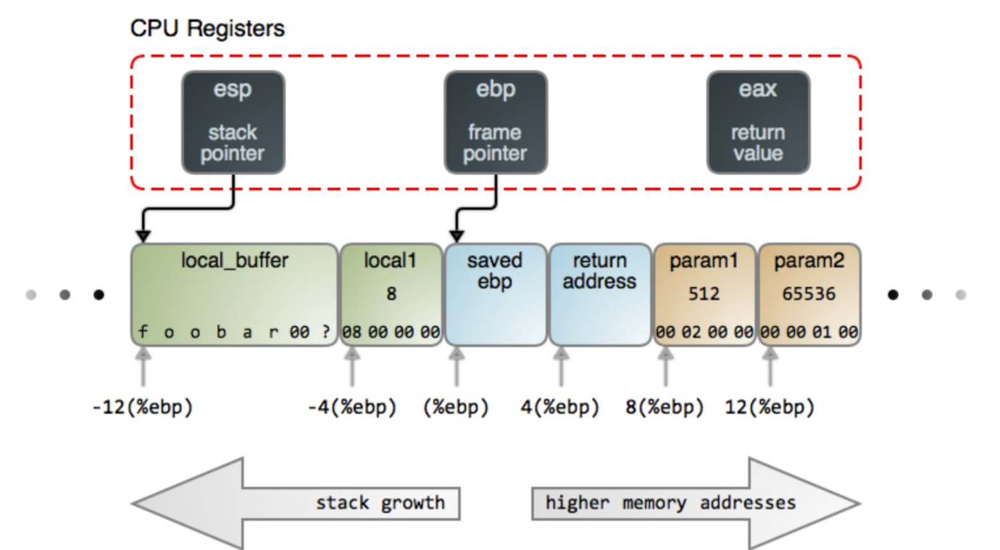

# Module 3 Notes

## A Model of Computer Systems

### How do Computers work?

At the center of the computer is the **Central Processing Unit**, who's main job is to execute programs. All CPU's have their own machine language and any and all code must be written in or translated into that language to run.

While a CPU runs a program, it stores said program in the computer's **Main Memory (RAM)**. RAM consists of a squaence of locations and each location has an **address**. When the CPU needs information, it sends a request to the RAM, which snds the requested data back.

This process is called **Fetch and Execute**, where the CPU fetches instructions, executes it, and then moves on to the next set. Every CPU has a few **registers** onboard which serve as memory, one of which is the program counter, a register that tells the CPU where it is in the program.

### Asyncrhonous Events

A complete computer system contains a lot more than just a CPU and RAM, so we need to be able to access all of these as well. How does the CPU communicate with all these extra devices? A bad process is called **polling**, where the CPU just constantly checks for new inputs and handles them. A better method is **interrupts**, where devices interrupt the CPU, the CPU completes their request, and then it goes back to what it was previously doing. The process of stopping its task, saving info, handling the interrupt, etc. is all done through instructions known as a **interrupt handler.**

Interrupts are how CPUs go from syncronous events (predetermined string of instructions) to asynchronous ones (random strings of instructions).

Each task the CPU works on is called a **Process**. A process that contains myltiple streams of execution is called a **Thread**. Every **Core** of a CPU can run one thread at a time (barring we're not swapping between threads)

### The Java Virtual Machine (JVM)

Most languages are high level and incomparable to machine code. As such, they require **compilers** to translate the high level code into machine code, and then runs it. Another option is a **interpreter**, which translates Machine Code instruction by instruction.

Java decided to use both! It compiles Java into machine code, but that machine code is for the **Java Virtual Machine**, an interpreter. Why this choice? Because the JVM can run on any machine, and that means java machine code can be distributed to any machine, rather than high level java code that needs to be compiled by each user for the personal machine. Since the JVM is a relatively simple program compared to an actual compiler, it makes it much easier to write a JVM for a new machine rather than an entire compiler.

### Fundemental Structure of Programs

Programming has two basic aspects:
- Data: A Memory Location given a specific name
- Instructions: Manipulations of data

Programs have a few basic types of control structures:
- Loops: Used for repeating instructions
- Branches: Used for determining courses of action
- Subroutines: Repeatable tasks that a program can take

### Objects and OOP

One type of programming is to use a top down approach. Split a larger problem into smaller chunks and solve each independently to build a program. However, this resulted in mostly single-purposed code that was hard to reuse.

**Bottom-Up** programming instead suggests taking problems you already know how to solve and grouping them together to solve a larger one. Key to this concept are modules. Small components of a system that take inputs and produce outputs-separate from the rest of the program, called **information hiding**.

These modules are called **Objects**, and contain data and subroutines.

## A Brief History of a Program

When we execute instructions, we need a good way to store memory. We try not to access memory locations exactly since no other program will be able to use that location if we want things to run properly. One approach is to use offsets from a base address. Generally, however, no memory location can be shared between two programs running simultaneously.

For efficiency, programs compute addresses as an offset from a stack pointer. Memory gets divided into the **Stack**, where local variables are stored, and **Heaps**, which store data whose sizes cannot be predetermined. An `int` can easily lie on a stack since it has a 32 bit integer limit, whereas aan `ArrayList` needs to lie on a Heap since we have no way of knowing how large it gets (a primitive could get stored on a heap if its part of an object!).

### Call Stacks and Stack Frames

In general, program execution can be described as pushing and popping data on stacks and putting any information that survive across functions onto the heap. We can make this easier to compute with a **Stack Frame**, which contains the function's local vairables, arguments, and housekeeping information to help it return to its caller.

<p align="center">  </p>

Noticably, we have three CPU register:
- ESP always points to the top of the stack, usually denoted by the *lowest memory address* of the stack.
- EBP points to the location in the stack *currently running*. It provides a stable reference point for acces to local variables and arguments, where each is just stored as an offset from the EBP.
- EAX is used to transfer values back to the caller.

Remember that since the stack grows to smaller memory addresses, we actually *subtract* to get bigger, somewhat counterintuitively.

## Recursion

In essence, recursion refers to problems in which solving it requires solving a smaller instance of the same problem. Take for example, fibonacci numbers, where any result is computed by finding the two fibonacci numbers smaller than it.

To use the recursive process, we need to define two properties:
- A base case that does not rely on recursion and can terminate
- A recursive step that points back to itself.


In general, recursive methods should be helper methods and not the method itself (i.e. `fibonnaciCalculator` should utilize a private method that actual calculates it). Recurison is entirely implementation specific and as such, specs should make no reference to it.

Recursive Methods should allow reentrancy, which just means you can run an instance of it while another instance is already running. For most cases, this works just fine since we use instance variables unique to each instance of the method. But keep this in mind when developing recursive methods.

## Lambdas and Streams

Lambdas can be imagined as inner functions. They describe in the most basic terms how we take objects/types and manipulate them. A sorter may only depend on whether or the difference between two values is negative or positive and can rely entirely on a small function that represents that.

Rather than being forced to write entire classes or methods, lambdas make the compiler take care of the overhead so we can focues purely on the objects at hand.

**Streams** are operations that can be used to express computation over collections of data compactly without using loops and sleection statements.

Understanding streams properly requires understanding some other stuff:

**Functions as Values:** We can use functions as values through the syntax
``` Java
Math.sqrt(x) // Which Becomes...
Math::sqrt
```

**Map**

Applies a unary function to each element and returns it as a new one in the same order

**Filter**

Returns a new list containing only elements that match some boolean operation

**Reduce**

Combines elements of the list together, like adding all elements of the list together

## Grammars

A grammar describes sequences of symbols in a compact way. It's made up of:
- Tokens (Terminals): The building blocks (symbols, punctuation)
- Nonterminals: Placeholders for patterns of tokens
- Operators: that arrange tokens and nonterminals in sequences Common Operators include:
  - Sequence: `x::=yz` means an `x` is composed of `y` followed by `z`
  - Repetition: `x::=y*` means `x` is zero or more `y`
  - Choice `x::=y|z` means `x` is either y or `z`

A `url`, for example, could be a nonterminal with a token like `www.` or `.com`.

A regular grammar is a grammar that contains no recursion, also known as a *regular expression* (i fucking hate it). They're concise and far easier to understand, but lack complexity and can't detect lots of subpatterns.

**Context-Free Grammars**</br>
Grammars tha have recursive rules that allow nonterminals to reference themselves, enabling hierarchies.

**Lexing**</br>
Braeks down a sequence of characters into tokens

**Parsing**</br>
Analyzes tokens to a grammar

Typically, you'll see lexers and parsers working in tandem to find patterns in a given string of text.

So what is a Regular Grammar? Simply put, its a grammar that denotes nested or recursive structures. You might think this just means a grammar or nonterminal that calls itself. But that's not entirely true. Some grammars can call themselves without the use of nested structure. The Grammar `A = aA | bA` looks for all strings that are sequences of As and Bs, but it doesn't *require* recursion to solve.